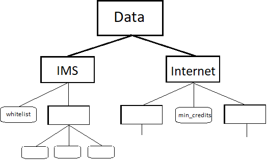
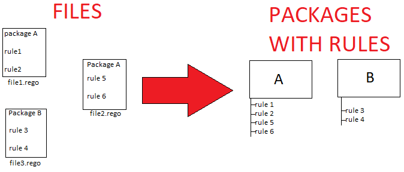

# PCRF-OPA
This will not teach you the Open Policy Agent. The aim of this doc it to greatly understand the structure of data and packages in OPA. 
The logics of smashing the right URL endpoints with the right json contents.


Lets us have a little play in very simplified and imagined world, where we are admins of a PCRF (Policy and Charging Rule Function). 

In our PLMN, we have two services that we want regulate the access to:
- **Internet**, to which we regulate the access by checking if user has enough credits (user can buy credits with money)
- **IMS**, to which we refulate the access by whitelist (user can buy membership with money)

A user in our PLMN is represented with its {imsi, credits}. E.g.
```json
{
    "imsi": "600500700",
    "credits": 200
}
```
## Data
Somewhere we need to store the information which IMSI's are allowed to access IMS and what is the minimal required credits number to use the Internet.
To store some business knowledge (in contrary to the policy logic) OPA uses concept of data:
The data in our case will look like this:
```json
{
    "ims": {
        "whitelist": [
            "600500700",
            "100200300",
            "420692137"
        ]
    },
    "internet": {
        "min_credits": 100
    }
}
```
As you can see, we have two domains Internet and IMSI. Of course this example is very simple, but you can image that these domains can contain much more than one field. The tree structure of our data is depicted below:
.

What is import is that the structure above is reflected in the URI that you will use to CRUD the objects of data.

e.g. `GET $OPA_URL/v1/data` will return you the whole json same as above.

e.g. `GET $OPA_URL/v1/data/internet` will return:
```json
{
    "min_credits": 100
}
```
e.g. `GET $OPA_URL/v1/data/ims/whitelist` will return:
```json
[
    "600500700",
    "100200300",
    "420692137"
]
```

And of course you can use PUT/DELETE methods on these json fields. In general, `$OPA_URL/v1/data` gives you REST API interface to work with big json document.

Ok, let's come back to our journey.
## Policies
Now, we need to define the policies. We will have two policies, one that allows users to internet and one that allows them to the ims.
Some PLMN network element will query our OPA server. Note that both policies will be named `allow_user` (since network elements queries if to allow user or not). But one will pertain the Inernet domain and one the ims. This is why, OPA comes with **packages**.

The file with policies for Internet. This file can include several polcies (but has one as for now).
```rego
package internet

import rego.v1

default allow_user := false

allow_user if {
	input.user.credits > data.internet.min_credits
}
```
The file with policies for IMS. Yes OPA stores polcies in files as you will pass them here.
```rego
package ims

import rego.v1

default allow_user := false

allow_user if {
	some i
	input.user.imsi == data.ims.whitelist[i]
}
```

One ***policy file*** can define multiple ***rules*** for some package and also a package can have its rules in multiple files.
OPA from these files generates packages and rules inside of the packages.


## API
### Adding data and policies
#### Data
To add data perform cURL HTTP request.
```curl
curl --location --request PUT 'http://192.168.56.106:8181/v1/data/' \
--header 'Content-Type: application/json' \
--data '{
    "ims": {
        "whitelist": [
            "600500700",
            "100200300",
            "420692137"
        ]
    },
    "internet": {
        "min_credits": 100
    }
}'
```
#### Policies
```curl
curl --location --request PUT 'http://192.168.56.106:8181/v1/policies/internet' \
--header 'Content-Type: text/plain' \
--data 'package internet

import rego.v1

default allow_user := false

allow_user if {
	input.user.credits > data.internet.min_credits
}'
```
```curl
curl --location --request PUT 'http://192.168.56.106:8181/v1/policies/ims' \
--header 'Content-Type: text/plain' \
--data '```rego
package ims

import rego.v1

default allow_user := false

allow_user if {
	some i
	input.user.imsi == data.ims.whitelist[i]
}'
```

### Queries
Ok, our OPA Server have the data and policy rules applied. Now it is ready to listen to queries from the PLMN Network Elements.
The goal of Network Elements is to obtain knowledge if it can allow certain user to IMS or Internet.
The input of the query will always look the same as the user is the only subject of authorization.

If Network Element (NE) wants to authorize user in the domain of ims it will use the ims package and the concrete rule of "allow_user".

The URL for this query will look like this: `$OPA_URL/v1/data/ims/allow_user` and in general it is `$OPA_URL/v1/data/<package>/<rule>`.

Two exemplary queries:
```curl
curl --location 'http://192.168.56.106:8181/v1/data/ims/allow_user' \
--header 'Content-Type: application/json' \
--data '{
    "input": {
        "user": {
            "credits": 500,
            "imsi": "600500700"
        }
    }
}'
```
```curl
curl --location 'http://192.168.56.106:8181/v1/data/internet/allow_user' \
--header 'Content-Type: application/json' \
--data '{
    "input": {
        "user": {
            "credits": 100,
            "imsi": "600500700"
        }
    }
}'
```

### Summary
So as you can see, in general the API can be divided into two parts:
- `policies` - the one under which you can put your policy files.
- `data` - the one under which you can put data and POST your queries.


Rego package `ims` has its root field in data document under `ims` field and thus when you define some variable in a package the `http://192.168.56.106:8181/v1/data/` will return it to you. `data` takes into account both **base documents** and **vritual documents**.

**Base document** is the data, that you've added via HTTP requests.
**Virtual document** is the data, that packages define in rego files.

The data that you see under `GET $OPA_URL/v1/data` is the conjunction of both virtual and base documents.

If you hit with `POST` some `/data/package/rule` the OPA Server will evaluate its value based on your input and give it back to you.


